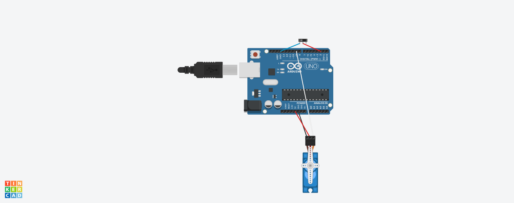

# Servo Moteur
(Le fichier s'appelle Blink à cause de restrictions du logiciel Arduino)

## Introduction
Servo Moteur est la seconde partie du projet

## Schéma et fonctionnement

Lorsque le circuit est fermé par le switch entre la pin 2 et le GND, le programme est en mode running et fait clignoter la LED intégrée (L).
Il renvoie également l'état des LED dans la sortie console.

Lorsque le cicuit est ouvert, le programme est en mode standby et ne fait rien en attendant que l'interrupteur soit actionné pour fermer de nouveau le curcuit.
Il renvoie également dans la sortie console qu'il est en standby.

La nouveauté ici est qu'il y a un servo moteur.
Il n'y en a qu'un pour des raisons de test, mais à terme il y en aura deux:
* Un pour soulever le couvercle de la boite
* Un autre avec le doigt monté dessus et qui va actionner le bouton en façade
